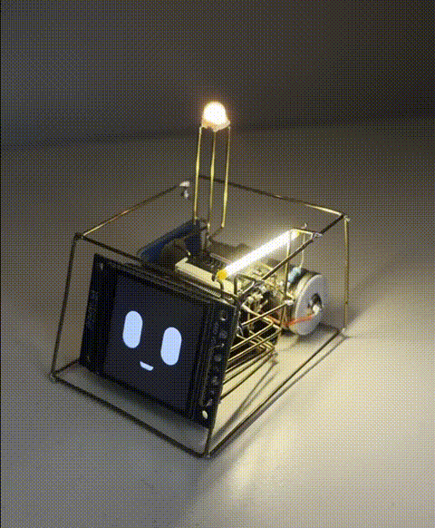

# Desktop Co-Pilot

Asistente de escritorio con IA + hardware (ESP32-S3) para:

- Cargar notas de reuniones y guardarlas como memoria consultable (RAG).
- Hacer preguntas sobre esas notas en lenguaje natural.
- Hablar con el asistente por voz.
- Controlar luces del hardware desde comandos generados por la IA.
- Configurar el dispositivo desde la web (luces, pantalla, imagen de reposo) y actualizarlo por OTA.
- Hostearlo en una Raspberry Pi y entrar desde cualquier lado sin port forwarding.

Proyecto pensado para uso diario de trabajo: capturas notas, las dejas indexadas, y despues consultas contexto cuando lo necesites.

## Foto del hardware




## Que hace hoy

- Backend FastAPI para:
  - Procesar notas de reuniones (`/process-notes`).
  - Recibir audio del ESP32 y responder con audio (`/voice-assistant`).
  - Recuperar contexto desde ChromaDB (RAG) para responder preguntas.
  - Guardar tareas/notas en Notion.
  - Servir la configuracion del dispositivo (`/device`), las imagenes de pantalla y el firmware OTA.
- Firmware para ESP32-S3 (Seeed XIAO ESP32S3) que:
  - Se conecta por Wi-Fi (WiFiManager + portal cautivo).
  - Graba audio mientras mantenes presionado el touch sensor.
  - Envia audio al backend.
  - Reproduce la respuesta TTS del asistente.
  - Ejecuta comandos de luces recibidos en el header HTTP `X-Action`.
  - Sondea la configuracion remota y aplica colores, encendidos e imagen de pantalla.
  - Entra al tailnet de Tailscale por su cuenta (MicroLink) y le habla al backend
    punto a punto, sin exponerlo a internet.
  - Se autoactualiza por OTA si el backend publico un build mas nuevo, sin intervencion.

## Estado actual

- Grabacion activada por touch sensor (mantener presionado).
- Control de luces funcionando por comandos:
  - `LED_RGB:R,G,B`
  - `LED_BRIGHTNESS:V`
  - `FILAMENT_ON`
  - `FILAMENT_OFF`
- Configuracion remota del dispositivo en `http://<backend>:8000/device`:
  - Encendido independiente del LED RGB, el LED de filamento y la pantalla.
  - Color y brillo del NeoPixel.
  - Imagen de reposo elegida del catalogo (extraido de `Imagenes.pdf`) o subida propia.
  - Publicacion de firmware para OTA.
- Actualizacion OTA automatica: push a `main` -> GitHub Actions compila y publica -> el backend
  lo espeja -> el ESP32 se actualiza solo (al arrancar o cada 15 min en reposo), verificando SHA-256.
- Trabajo en progreso: keyword spotting para iniciar grabacion sin tocar boton/sensor.

## Arquitectura

```text
ESP32 (mic + speaker + LEDs)
  -> envia WAV por HTTP multipart, dentro del tunel WireGuard del tailnet
FastAPI (/voice-assistant)
  -> STT (Groq Whisper)
  -> RAG (Gemini Embeddings + ChromaDB)
  -> respuesta IA (Gemini)
  -> TTS (edge-tts)
ESP32
  <- recibe MP3 + X-Action y ejecuta luces
```

## Estructura del repo

```text
desktop-copilot/
|- .github/
|  |- workflows/firmware.yml     # compila y publica el firmware en cada push
|  \- scripts/firmware_manifest.py
|- Imagenes.pdf           # laminas de origen para las imagenes de pantalla
|- backend/
|  |- app/
|  |  |- assets/default_images/  # PNG 240x240 extraidos del PDF
|  |  \- templates/              # layout.html + una plantilla por seccion
|  |- chroma_db/
|  |- data/               # config del dispositivo + firmware OTA (no versionado)
|  |- scripts/
|  |- tests/
|  |- requirements.txt
|  \- .env.example
\- firmware/
   |- include/
   |- src/
   \- platformio.ini
```

## Requisitos

### Backend

- Python 3.10+
- API key de Gemini (obligatoria)
- API key de Groq (recomendada para STT)
- Notion API + Database ID

### Firmware

- PlatformIO
- Placa objetivo: `seeed_xiao_esp32s3`
- Librerias (definidas en `platformio.ini`):
  - `ESP8266Audio`
  - `Adafruit NeoPixel`
  - `TFT_eSPI`
  - `WiFiManager`
  - `ArduinoJson`
- Tabla de particiones `default_8MB.csv` (la del board): trae `app0`/`app1`, necesarias para OTA.

## Setup rapido

### 1) Backend

Desde `backend/`:

```powershell
python -m venv .venv
.\.venv\Scripts\Activate.ps1
pip install -r requirements.txt
copy .env.example .env
```

Completa `backend/.env`:

```env
GEMINI_API_KEY=
GROQ_API_KEY=
NOTION_API_KEY=
NOTION_DATABASE_ID=
# CHROMA_PATH=./chroma_db
```

Levantar servidor:

```powershell
uvicorn main:app --reload --host 0.0.0.0 --port 8000
```

Panel web en `http://127.0.0.1:8000/`, con barra de navegacion y una seccion por tema:

- `/notes` - subir notas de reunion.
- `/personality` - personalidad del asistente.
- `/device` - luces, pantalla e imagen de reposo.
- `/firmware` - publicar firmware para OTA.

`/dashboard` sigue funcionando y redirige a `/notes`.

Si `PANEL_PASSWORD` esta seteada en `backend/.env`, el panel pide login en `/login`.

### 2) Firmware

Desde `firmware/`:

```powershell
pio run -e xiao_esp32s3
pio run -e xiao_esp32s3 -t upload
pio device monitor -b 115200
```

En el primer arranque:

- El ESP32 abre portal Wi-Fi (`ESP32_Asistente`) si no tiene red guardada.
- Configura SSID/password y la URL del backend (ejemplo: `http://192.168.100.99:8000/voice-assistant`).
- La URL queda persistida en LittleFS (`/config.txt`).

## Uso

1. Cargas notas de reunion al backend (`/process-notes`) para indexarlas.
2. Mantienes presionado el sensor touch del hardware para hablar.
3. El backend transcribe, consulta RAG y responde por voz.
4. Si en la respuesta hay comandos de luces, el firmware los ejecuta.

## Endpoints principales

- `POST /process-notes`
  - Body JSON: `{"notes_text": "..."}`
  - Extrae proyectos, resumen, tareas, feedback y lo guarda (RAG/Notion).
- `POST /voice-assistant`
  - Multipart con `file` (audio) y `session_id`.
  - Devuelve `audio/mpeg` + header `X-Action` para hardware.
- `POST /update-personality`
  - Permite cambiar personalidad del asistente.
- `GET /notes`, `GET /personality`, `GET /device`, `GET /firmware`
  - Las cuatro secciones del panel. `GET /` y `GET /dashboard` redirigen a `/notes`.
- `GET /device/config`
  - Vista compacta que sondea el ESP32 cada 5 s. Trae `revision`, estado de cada
    salida, color/brillo del RGB y la imagen activa con su checksum.
- `POST /device/config`
  - Actualizacion parcial (`rgb_enabled`, `rgb_color`, `rgb_brightness`,
    `filament_enabled`, `display_enabled`, `image_id`, `clear_image`).
    Cada cambio sube `revision`, que es lo que dispara el refresco en el firmware.
- `GET /device/images` / `POST /device/images` / `DELETE /device/images/{id}`
  - Catalogo, subida y borrado de imagenes. Todo se normaliza a 240x240.
- `GET /device/image`
  - Imagen activa en RGB565 little-endian (115200 bytes), lista para `pushImage`.
- `GET /ota/manifest`
  - `{"available", "version", "build", "url", "sha256", "size", ...}`.
- `POST /ota/firmware`
  - Multipart con `file` (firmware.bin), `version`, `build` y `notes`.
- `GET /ota/download`
  - Binario publicado.
- `GET /ota/sync` / `POST /ota/sync[?force=true]`
  - Estado del espejado desde GitHub y disparo manual.

## Configuracion del dispositivo

La pagina `/device` guarda todo en el backend y el ESP32 lo aplica solo:

- **LED RGB, LED de filamento y pantalla** se prenden y apagan por separado.
  El comando de voz `ALL_OFF` sigue siendo un apagado temporal: no pisa la
  configuracion guardada y el proximo toque del sensor devuelve todo a como estaba.
- **Color y brillo** del NeoPixel se eligen desde la web y quedan persistidos.
- **Imagen de pantalla**: se elige del catalogo o se sube una propia. El backend la
  convierte a RGB565 y el ESP32 la descarga una sola vez (se compara por checksum)
  a `/idle565.raw` en LittleFS.

Comportamiento de la imagen:

1. En reposo el ESP32 muestra la imagen elegida.
2. Al tocar el sensor para hablar, la imagen desaparece al instante y vuelve la cara animada.
3. Durante grabacion, espera y reproduccion se anima la cara como siempre.
4. Al terminar la interaccion reaparece la imagen.
5. Si no hay imagen elegida, la cara animada funciona igual que antes.

La configuracion tambien se guarda en el ESP32 (`/settings.json` en LittleFS), asi
que el dispositivo arranca con el ultimo estado conocido aunque el backend este caido.

## Actualizacion OTA automatica

El flujo completo, sin pasos manuales:

```text
editas firmware/ y haces push a main
  -> GitHub Actions compila y publica un release (fw-<version>-<build>)
  -> el backend detecta el release, verifica el SHA-256 y lo publica en /ota/manifest
  -> el ESP32 consulta el manifest (al arrancar y cada 15 min en reposo)
  -> si el build remoto es mayor: descarga, revalida el SHA-256 y reinicia
```

GitHub Actions no puede alcanzar el backend porque vive en la LAN, asi que el
backend es el que va a buscar: cada 5 minutos consulta los releases del repo.

### El numero de build sube solo

`FIRMWARE_BUILD` sale de `git rev-list --count HEAD`, inyectado por
`firmware/scripts/build_number.py` tanto en local como en CI. No hay que editarlo.
Como local y CI calculan lo mismo para un commit dado, un firmware que flasheas
por USB no queda "viejo" y el ESP32 no lo pisa; recien se actualiza cuando CI
compila un commit posterior.

`FIRMWARE_VERSION` en `firmware/include/version.h` si es manual: es el numero
semantico que se muestra en pantalla y nombra el release.

### Configuracion del espejado

En `backend/.env`:

```env
FIRMWARE_REPO=genti91/desktop-copilot
# FIRMWARE_AUTO_SYNC=1              # 0 para desactivar el chequeo automatico
# FIRMWARE_SYNC_INTERVAL_SECONDS=300
# GITHUB_TOKEN=                     # solo para repos privados o limites de rate
```

Desde `/firmware` se ve el estado del ultimo chequeo y hay botones para
buscar ahora o forzar una reinstalacion.

### Publicar a mano

Sigue disponible como alternativa: compilar con `pio run -e xiao_esp32s3` y subir
`firmware/.pio/build/xiao_esp32s3/firmware.bin` desde `/firmware`, con un build
mayor al instalado.

`firmware/partitions.csv` reserva `app0`/`app1` (3.1 MB cada una), asi que no hace
falta tocar el esquema de particiones.

### Compilar el firmware

MicroLink es un submodulo, asi que un clon nuevo necesita:

```bash
git submodule update --init --recursive
```

Arduino compila como componente de ESP-IDF, y eso trae dos requisitos que el
framework precompilado no tenia:

- **En Windows hay que compilar desde PowerShell o cmd, no desde Git Bash.** El
  instalador de herramientas de ESP-IDF (`idf_tools.py`) se niega a correr bajo
  MSys/Mingw, y el build falla al no encontrar cmake ni ninja.
- El component manager de IDF descarga dependencias a `firmware/managed_components/`.
  Un antivirus que retenga esos archivos recien extraidos hace fallar la
  descompresion; si pasa, borra el directorio y volve a compilar.

## Hostear en una Raspberry Pi

El backend corre en la misma Pi que OctoPrint y se accede desde cualquier lado por
Tailscale, sin port forwarding (sirve aunque el ISP use CGNAT).

Guia completa: [docs/raspberry-pi.md](docs/raspberry-pi.md). Resumen:

```text
tu celular / laptop  -> Tailscale -> Raspberry Pi :8000  (panel con password)
ESP32 (en cualquier lado) -> Tailscale -> Raspberry Pi :8000
```

El ESP32 tambien es un nodo del tailnet: corre
[MicroLink](https://github.com/CamM2325/microlink), un cliente de Tailscale para
ESP-IDF. DISCO abre un camino UDP directo contra la Pi, asi que el audio no da
la vuelta por un relay y el backend no queda publicado en internet.

Instalacion en un comando sobre la Pi:

```bash
curl -fsSL https://raw.githubusercontent.com/genti91/desktop-copilot/main/deploy/install-pi.sh | bash
```

El service de systemd esta en [deploy/desktop-copilot.service](deploy/desktop-copilot.service).
